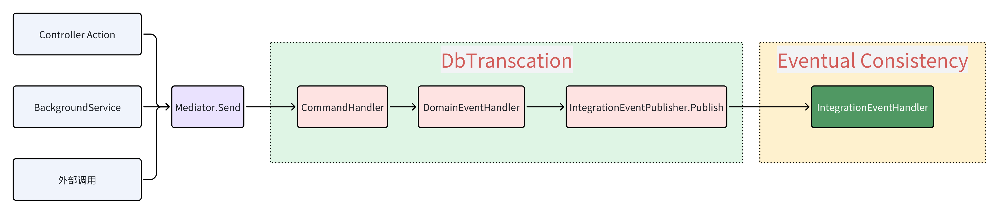

# 事务

下图展示了一个事务的生命周期：

框架会在 `CommandHandler` 开始前开启一个事务，由 `CommandHandler` 操作领域模型而发出的`DomainEvent` 会被`DomainEventHandler`处理，处理完成后会提交事务。如果在`CommandHandler`或`DomainEventHandler`中发生异常，事务会回滚。

如果在`DomainEventHandler`中将`DomainEvent`转换为`IntegrationEvent`，则会在当前数据库事务中将`IntegrationEvent`持久化到数据库，如果持久化失败，会抛出异常，事务会回滚。

如果数据库事务提交成功，则会返回`CommandHandler`的执行结果，当前请求处理完成，同时会发布`IntegrationEvent`到消息队列。

`IntegrationEvent`会被订阅它地`IntegrationEventHandler`处理，处理完成后会提交事务。如果在`IntegrationEventHandler`中发生异常，框架会记录异常日志，并尝试重试，默认情况下会重试10次，每次重试会有一定地时间间隔。

