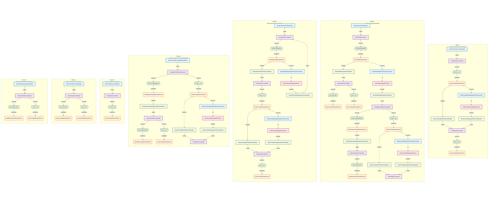

# 代码流分析 (Code Flow Analysis)

## 概述

`NetCorePal.Extensions.CodeAnalysis` 提供了强大的代码流分析功能，通过 `CodeFlowAnalysisSourceGenerator` 源生成器自动分析您的代码结构，帮助您理解 DDD 架构中各个组件之间的关系和数据流向。

## 功能特性

### 🔍 自动代码分析

- **命令发送者检测**：自动识别控制器、端点、事件处理器等发送命令的类型
- **聚合根识别**：检测实现了 `IAggregateRoot` 接口的聚合根
- **命令识别**：识别实现了 `ICommand` 接口的命令类型
- **事件检测**：自动发现领域事件和集成事件
- **处理器分析**：识别各种事件处理器和转换器

### 🔄 关系映射

源生成器会自动建立以下关系：

1. **方法到命令**：发送命令的方法与对应命令的关系
2. **命令到聚合方法**：命令处理器调用聚合方法的关系
3. **方法到领域事件**：聚合方法发出领域事件的关系
4. **领域事件到集成事件**：通过转换器的转换关系
5. **领域事件到处理器**：领域事件与其处理器的关系
6. **集成事件到处理器**：集成事件与其处理器的关系

## 使用方法

### 1. 安装包

在所有需要分析的项目中添加以下包引用：

```xml
<PackageReference Include="NetCorePal.Extensions.CodeAnalysis" />
```

> **注意**：`NetCorePal.Extensions.CodeAnalysis` 包已经包含了源生成器，无需单独安装源生成器包。确保在所有需要分析的项目中都添加此包引用。

### 2. 启用源生成器

源生成器会在编译时自动运行，无需额外配置。编译后会生成 `CodeFlowAnalysisResult.g.cs` 文件。

### 3. 访问分析结果

```csharp
using System.Reflection;
using NetCorePal.Extensions.CodeAnalysis;

// 使用 AnalysisResultAggregator 静态类获取分析结果
// 需要传入包含要分析代码的程序集
var assemblies = new[] { Assembly.GetExecutingAssembly() }; // 或者其他需要分析的程序集
var result = AnalysisResultAggregator.Aggregate(assemblies);

// 访问各种组件信息
var controllers = result.Controllers;
var commands = result.Commands;
var entities = result.Entities;
var domainEvents = result.DomainEvents;
var relationships = result.Relationships;
```

> **说明**：`Aggregate` 方法需要传入一个或多个程序集作为参数，这些程序集包含了需要分析的代码。您可以传入当前程序集、特定的业务程序集，或者项目中的多个程序集。

## 支持的代码模式

### 控制器和端点

```csharp
// ASP.NET Core 控制器
[ApiController]
public class UserController : ControllerBase
{
    public async Task<IActionResult> CreateUser([FromBody] CreateUserCommand command)
    {
        await _mediator.Send(command);
        return Ok();
    }
}

// FastEndpoints 端点
public class CreateUserEndpoint : Endpoint<CreateUserCommand>
{
    public override async Task HandleAsync(CreateUserCommand command, CancellationToken ct)
    {
        await SendAsync(command, ct);
    }
}
```

### 命令和处理器

```csharp
// 命令
public record CreateUserCommand(string Name, string Email) : ICommand;

// 命令处理器
public class CreateUserCommandHandler : IRequestHandler<CreateUserCommand>
{
    public async Task<Unit> Handle(CreateUserCommand request, CancellationToken cancellationToken)
    {
        var user = new User(request.Name, request.Email);
        // 业务逻辑...
        return Unit.Value;
    }
}
```

### 聚合根和领域事件

```csharp
// 聚合根
public class User : IAggregateRoot
{
    public User(string name, string email)
    {
        Name = name;
        Email = email;
        AddDomainEvent(new UserCreatedDomainEvent(Id, name, email));
    }
    
    public void UpdateProfile(string name, string email)
    {
        Name = name;
        Email = email;
        AddDomainEvent(new UserUpdatedDomainEvent(Id, name, email));
    }
}

// 领域事件
public record UserCreatedDomainEvent(Guid UserId, string Name, string Email) : IDomainEvent;
```

### 事件处理器和转换器

```csharp
// 领域事件处理器
public class UserCreatedDomainEventHandler : IDomainEventHandler<UserCreatedDomainEvent>
{
    public async Task HandleAsync(UserCreatedDomainEvent domainEvent, CancellationToken cancellationToken)
    {
        // 处理领域事件
        await _mediator.Send(new SendWelcomeEmailCommand(domainEvent.UserId));
    }
}

// 集成事件转换器
public class UserCreatedIntegrationEventConverter : IIntegrationEventConverter<UserCreatedDomainEvent, UserCreatedIntegrationEvent>
{
    public UserCreatedIntegrationEvent Convert(UserCreatedDomainEvent domainEvent)
    {
        return new UserCreatedIntegrationEvent(domainEvent.UserId, domainEvent.Name, domainEvent.Email);
    }
}

// 集成事件处理器
public class UserCreatedIntegrationEventHandler : IIntegrationEventHandler<UserCreatedIntegrationEvent>
{
    public async Task Subscribe(UserCreatedIntegrationEvent integrationEvent, CancellationToken cancellationToken)
    {
        // 处理集成事件
        await _mediator.Send(new SyncUserToExternalSystemCommand(integrationEvent.UserId));
    }
}
```

## 生成的分析结果

### 数据结构

```csharp
public class CodeFlowAnalysisResult
{
    public List<ControllerInfo> Controllers { get; set; } = new();
    public List<CommandInfo> Commands { get; set; } = new();
    public List<EntityInfo> Entities { get; set; } = new();
    public List<DomainEventInfo> DomainEvents { get; set; } = new();
    public List<IntegrationEventInfo> IntegrationEvents { get; set; } = new();
    public List<DomainEventHandlerInfo> DomainEventHandlers { get; set; } = new();
    public List<IntegrationEventHandlerInfo> IntegrationEventHandlers { get; set; } = new();
    public List<IntegrationEventConverterInfo> IntegrationEventConverters { get; set; } = new();
    public List<RelationshipInfo> Relationships { get; set; } = new();
}
```

### 关系类型

- `MethodToCommand`：方法到命令的关系
- `CommandToAggregateMethod`：命令到聚合方法的关系
- `MethodToDomainEvent`：方法到领域事件的关系
- `DomainEventToIntegrationEvent`：领域事件到集成事件的关系
- `DomainEventToHandler`：领域事件到处理器的关系
- `IntegrationEventToHandler`：集成事件到处理器的关系

## 可视化图表生成

框架提供了强大的 `MermaidVisualizer` 静态类，可以将分析结果转换为各种类型的 Mermaid 图表，帮助您直观地理解系统架构和数据流。

### 支持的图表类型

#### 1. 完整架构流程图

生成包含所有组件和关系的完整架构图：

```csharp
// 获取要分析的程序集
var assemblies = new[] { Assembly.GetExecutingAssembly() }; // 或者其他需要分析的程序集
var analysisResult = AnalysisResultAggregator.Aggregate(assemblies);

// 生成完整的架构流程图
var architectureChart = MermaidVisualizer.GenerateArchitectureFlowChart(analysisResult);
```

#### 2. 命令流程图

专注于命令执行流程的流程图：

```csharp
// 生成命令流程图
var commandChart = MermaidVisualizer.GenerateCommandFlowChart(analysisResult);
```

#### 3. 事件流程图

专注于事件驱动流程的流程图：

```csharp
// 生成事件流程图
var eventChart = MermaidVisualizer.GenerateEventFlowChart(analysisResult);
```

#### 4. 类图

展示类型间关系的类图：

```csharp
// 生成类图
var classDiagram = MermaidVisualizer.GenerateClassDiagram(analysisResult);
```

#### 5. 命令链路图

以命令为中心的详细执行链路图：

```csharp
// 生成命令链路图集合
var commandChains = MermaidVisualizer.GenerateCommandChainFlowCharts(analysisResult);
foreach (var (chainName, diagram) in commandChains)
{
    Console.WriteLine($"链路: {chainName}");
    Console.WriteLine(diagram);
}
```

#### 6. 多链路综合图

在一张图中展示多个命令执行链路：

```csharp
// 生成多链路综合图
var multiChainChart = MermaidVisualizer.GenerateMultiChainFlowChart(analysisResult);
```

**效果展示：**



#### 7. 独立链路图集合

生成每个链路的独立图表：

```csharp
// 生成所有独立链路图
var allChainCharts = MermaidVisualizer.GenerateAllChainFlowCharts(analysisResult);
```

**效果展示：**


### 图表特性

- **自动节点分类**：不同类型的节点使用不同的形状和颜色
  - 控制器：矩形，蓝色
  - 命令：矩形，紫色
  - 聚合根：菱形，绿色
  - 领域事件：圆形，橙色
  - 集成事件：矩形，粉色
  - 事件处理器：矩形，浅绿色
  - 转换器：梯形，蓝色

- **智能关系标注**：不同类型的关系使用不同的箭头和标签
  - 实线箭头：直接调用关系
  - 虚线箭头：事件处理关系
  - 粗实线箭头：重要业务流程

- **链路追踪**：能够完整追踪从用户请求到业务执行的完整链路

### 在线图表预览

生成的 Mermaid 图表可以使用 [Mermaid Live Editor](https://mermaid.live/edit) 进行在线预览和编辑：

1. **访问 Mermaid Live Editor**：打开 [https://mermaid.live/edit](https://mermaid.live/edit)
2. **粘贴图表代码**：将生成的 Mermaid 代码粘贴到编辑器中
3. **实时预览**：右侧会实时显示图表的渲染效果
4. **导出图片**：可以将图表导出为 PNG、SVG 等格式
5. **分享链接**：可以生成分享链接，方便团队协作

**使用步骤：**

```csharp
// 1. 生成 Mermaid 图表代码
var analysisResult = AnalysisResultAggregator.Aggregate(assemblies);
var mermaidCode = MermaidVisualizer.GenerateArchitectureFlowChart(analysisResult);

// 2. 打印或保存到文件
Console.WriteLine(mermaidCode);
File.WriteAllText("architecture.mmd", mermaidCode);

// 3. 复制代码到 https://mermaid.live/edit 进行预览
```

> **提示**：上方展示的效果图正是通过 Mermaid Live Editor 生成的。您可以将框架生成的任何 Mermaid 代码粘贴到该工具中进行可视化预览。

### 使用示例

```csharp
using System.Reflection;
using NetCorePal.Extensions.CodeAnalysis;

public class ArchitectureAnalyzer
{
    public void GenerateAllDiagrams()
    {
        // 获取要分析的程序集
        var assemblies = new[] 
        { 
            Assembly.GetExecutingAssembly(),
            // 可以添加其他需要分析的程序集
            // typeof(SomeTypeInAnotherAssembly).Assembly
        };
        var analysisResult = AnalysisResultAggregator.Aggregate(assemblies);
        
        // 生成完整架构图
        var architectureChart = MermaidVisualizer.GenerateArchitectureFlowChart(analysisResult);
        File.WriteAllText("architecture.md", $"```mermaid\n{architectureChart}\n```");
        
        // 生成命令流程图
        var commandChart = MermaidVisualizer.GenerateCommandFlowChart(analysisResult);
        File.WriteAllText("commands.md", $"```mermaid\n{commandChart}\n```");
        
        // 生成事件流程图
        var eventChart = MermaidVisualizer.GenerateEventFlowChart(analysisResult);
        File.WriteAllText("events.md", $"```mermaid\n{eventChart}\n```");
        
        // 生成类图
        var classDiagram = MermaidVisualizer.GenerateClassDiagram(analysisResult);
        File.WriteAllText("classes.md", $"```mermaid\n{classDiagram}\n```");
        
        // 生成命令链路图
        var commandChains = MermaidVisualizer.GenerateCommandChainFlowCharts(analysisResult);
        for (int i = 0; i < commandChains.Count; i++)
        {
            var (chainName, diagram) = commandChains[i];
            File.WriteAllText($"chain_{i + 1}.md", $"# {chainName}\n\n```mermaid\n{diagram}\n```");
        }
        
        // 生成多链路综合图
        var multiChainChart = MermaidVisualizer.GenerateMultiChainFlowChart(analysisResult);
        File.WriteAllText("multi-chain.md", $"# 系统执行链路总览\n\n```mermaid\n{multiChainChart}\n```");
        
        // 生成所有独立链路图
        var allChainCharts = MermaidVisualizer.GenerateAllChainFlowCharts(analysisResult);
        var allChainsMarkdown = "# 所有系统执行链路\n\n";
        for (int i = 0; i < allChainCharts.Count; i++)
        {
            allChainsMarkdown += $"## 链路 {i + 1}\n\n```mermaid\n{allChainCharts[i]}\n```\n\n";
        }
        File.WriteAllText("all-chains.md", allChainsMarkdown);
    }
}
```

## 实际应用场景

### 1. 架构分析

- 理解系统中的数据流向
- 识别潜在的循环依赖
- 验证 DDD 架构的正确性

### 2. 代码审查

- 检查是否遵循了 DDD 原则
- 确保命令和事件的处理流程正确
- 验证聚合根的封装性

### 3. 文档生成

- 自动生成系统架构图
- 创建 API 文档
- 生成数据流程图
- 制作技术分享演示文稿
- 为新团队成员提供系统概览图表

### 4. 测试支持

- 识别需要测试的关键路径
- 生成测试用例模板
- 验证业务流程的完整性

## 注意事项

1. **编译时分析**：源生成器在编译时运行，确保代码能够正常编译
2. **接口依赖**：确保相关类型实现了框架定义的接口
3. **命名约定**：遵循框架的命名约定以获得最佳分析结果
4. **性能考虑**：大型项目可能会增加编译时间

## 故障排除

### 常见问题

**Q: 为什么某些类型没有被识别？**
A: 确保类型实现了正确的接口，如 `ICommand`、`IAggregateRoot`、`IDomainEvent` 等。

**Q: 生成的分析结果不准确怎么办？**
A: 检查代码是否遵循了 DDD 的标准模式，特别是命令发送和事件处理的方式。

**Q: 如何排除某些类型的分析？**
A: 目前源生成器会分析所有符合条件的类型，暂不支持排除功能。

## 更多示例

更多使用示例请参考项目的测试代码和示例项目。
