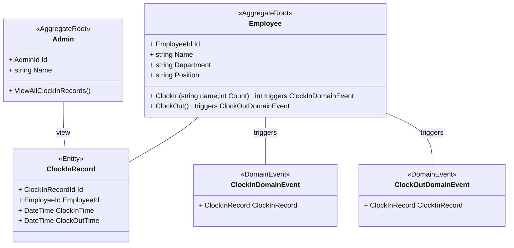

```mermaid
classDiagram

class Employee {
    <<AggregateRoot>>
    + EmployeeId Id
    + string Name
    + string Department
    + string Position
    + ClockIn(string name,int Count) int triggers ClockInDomainEvent
    + ClockOut() triggers ClockOutDomainEvent
}

class ClockInRecord {
    <<Entity>>
    + ClockInRecordId Id
    + EmployeeId EmployeeId
    + DateTime ClockInTime
    + DateTime ClockOutTime
}

class ClockInDomainEvent {
    <<DomainEvent>>
    + ClockInRecord ClockInRecord
}

class ClockOutDomainEvent {
    <<DomainEvent>>
    + ClockInRecord ClockInRecord
}

class Admin {
    <<AggregateRoot>>
    + AdminId Id
    + string Name
    + ViewAllClockInRecords()
}

Employee -- ClockInRecord
Employee -- ClockInDomainEvent : triggers
Employee -- ClockOutDomainEvent : triggers
Admin -- ClockInRecord : view
```